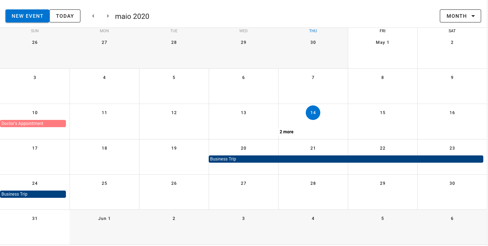

<h1 align="center">Vue Calendar - Firebase DB</h1>

 

   <a href="#-technologies">Technologies</a>&nbsp;&nbsp;&nbsp;|&nbsp;&nbsp;&nbsp;
   <a href="#-project">Project</a>&nbsp;&nbsp;&nbsp;&nbsp;&nbsp;&nbsp;
 

 

    
 

 ## :rocket: Technologies

A calendar application using VueJS, Vuetify components for the front-end and Google Firebase as DB:

 - [VueJS](https://vuejs.org)
 - [Vuetify](https://vuetifyjs.com/en/)
 - [Firebase](http://firebase.google.com/)

 ## 💻 Project

Wanna see a live version ? Check it out: [Vue Calendar](https://doug-vue-calendar.netlify.app).

 ---
<h4 align="center">
   Code and coffee ☕
</h4>
